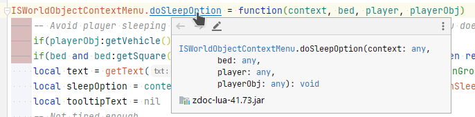

# Project Zomboid Decompiler Template

This project is a template for decompiling Project Zomboid source files and using them in a mod. Knowledge of Gradle is expected.

## Guide

### 1. Set `gameDir`

Set `gameDir` in the `local.properties` file to the location of your game files.

Example:
```properties
gameDir=D:/Games/SteamLibrary/steamapps/common/ProjectZomboid
```

### 2. Run gradle task `setupWorkspace`

Run `gradlew setupWorkspace` to decompile the game.

This creates a `lib` folder with the Project Zomboid code. This will be used in step 3.

### 3. Setup your mod project with Gradle

Create a `mod.info` file in the root of your mod project.

```properties
name=Example Mod.info
id=example_mod_info
modversion=1.0.0
poster=example_mod_info.png
description=Example Mod Info
url=https://github.com/drandarov-io/zomboid-decompiler-template
```

Create a `build.gradle.kts` with the following content:

```kotlin
plugins {
    java
}

val zomboidjar: String by project
val zomboidlua: String by project


dependencies {
    implementation(files(zomboidjar))
    implementation(files(zomboidlua))
}
```
Create the gradle.properties file with the following content:

```properties
zomboidjar = ../zomboid-decompiler-template/lib/zomboid-sources.jar
zomboidlua = ../zomboid-decompiler-template/lib/zdoc-lua-41.73.jar
```

The paths need to point to the jars generated in the second step.

Now you have a mod project ready to use with IntelliSense support:

